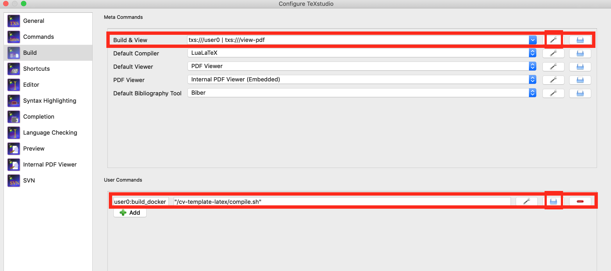
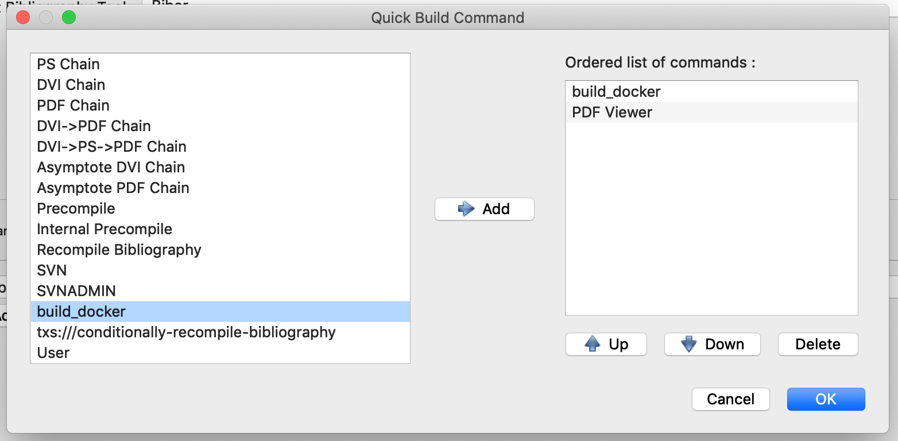

# Integrating Docker-based LaTeX compilation with TeXstudio

## Mac

1. Create script `compile.sh` that will run the LaTeX compilation inside the Docker container. It's also good practice to specify the exact image version, instead of using the `latest` tag. E.g.:
```
#!/bin/sh
IMAGE=jpdias92/cv-template-latex:1.00
exec docker run --rm -i --user="$(id -u):$(id -g)" --net=none -v "$PWD":/data "$IMAGE" latexmk -pdflatex=lualatex -cd -f -interaction=batchmode -pdf template.tex
```
2. Under `Configure TeXstudio -> Build`, create a new user command that will run the script we just created.
   1. Click Add
   2. Select program -> Select the `compile.sh` script in your file system
   3. Give the command a name, e.g. `build_docker`
3. Now, we will change the default Build & View button to run our user command and then view the PDF.
   1. Go go Build & View -> Configure
   2. Do the necessary changes to just have, on the right-hand side, two steps, the `build_docker` user command first and the `PDF Viewer` second.
4. Now, we can use the quick build button to run the build inside our container and immediately view the result on the integrated PDF viewer.





